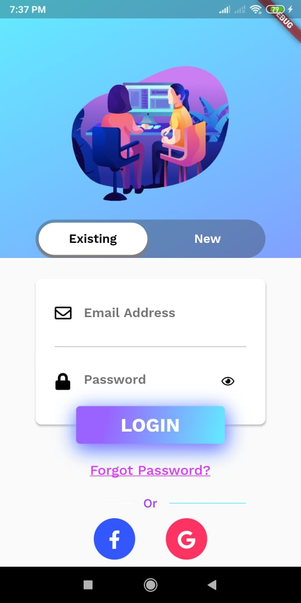

# OCR-and-language-translation

# Currently working on it
Please find:
[WriteUp](https://drive.google.com/file/d/1VBUjPQWALCnrJDHQiuuFQBlQDU0gxmUj/view?usp=sharing) 

We are building a mobile based and web based platform for Optical Character Recognition (OCR) and translating into user desired language.

Beside from OCR, we are implementing Object detection and then translating the text of detected object into user desired language.

Find code for Object Recognition [here](https://github.com/ashish807/OCR-and-language-translation/tree/master/Object%20Detetion)

login page of our app: 

Object Detection: 

